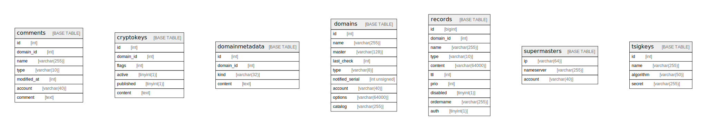

# isudns

## Tables

| Name | Columns | Comment | Type |
| ---- | ------- | ------- | ---- |
| [comments](comments.md) | 7 |  | BASE TABLE |
| [cryptokeys](cryptokeys.md) | 6 |  | BASE TABLE |
| [domainmetadata](domainmetadata.md) | 4 |  | BASE TABLE |
| [domains](domains.md) | 9 |  | BASE TABLE |
| [records](records.md) | 10 |  | BASE TABLE |
| [supermasters](supermasters.md) | 3 |  | BASE TABLE |
| [tsigkeys](tsigkeys.md) | 4 |  | BASE TABLE |

## Relations

---

> Generated by [tbls](https://github.com/k1LoW/tbls)
