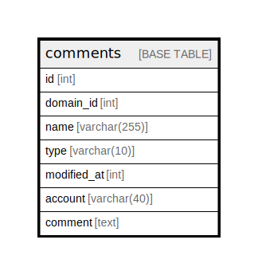

# comments

## Description

<details>
<summary><strong>Table Definition</strong></summary>

```sql
CREATE TABLE `comments` (
  `id` int NOT NULL AUTO_INCREMENT,
  `domain_id` int NOT NULL,
  `name` varchar(255) NOT NULL,
  `type` varchar(10) NOT NULL,
  `modified_at` int NOT NULL,
  `account` varchar(40) CHARACTER SET utf8mb3 COLLATE utf8mb3_general_ci DEFAULT NULL,
  `comment` text CHARACTER SET utf8mb3 COLLATE utf8mb3_general_ci NOT NULL,
  PRIMARY KEY (`id`),
  KEY `comments_name_type_idx` (`name`,`type`),
  KEY `comments_order_idx` (`domain_id`,`modified_at`)
) ENGINE=InnoDB DEFAULT CHARSET=latin1
```

</details>

## Columns

| Name | Type | Default | Nullable | Extra Definition | Children | Parents | Comment |
| ---- | ---- | ------- | -------- | ---------------- | -------- | ------- | ------- |
| id | int |  | false | auto_increment |  |  |  |
| domain_id | int |  | false |  |  |  |  |
| name | varchar(255) |  | false |  |  |  |  |
| type | varchar(10) |  | false |  |  |  |  |
| modified_at | int |  | false |  |  |  |  |
| account | varchar(40) |  | true |  |  |  |  |
| comment | text |  | false |  |  |  |  |

## Constraints

| Name | Type | Definition |
| ---- | ---- | ---------- |
| PRIMARY | PRIMARY KEY | PRIMARY KEY (id) |

## Indexes

| Name | Definition |
| ---- | ---------- |
| comments_name_type_idx | KEY comments_name_type_idx (name, type) USING BTREE |
| comments_order_idx | KEY comments_order_idx (domain_id, modified_at) USING BTREE |
| PRIMARY | PRIMARY KEY (id) USING BTREE |

## Relations



---

> Generated by [tbls](https://github.com/k1LoW/tbls)
