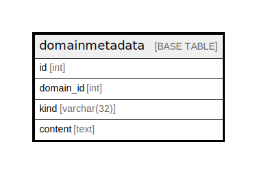

# domainmetadata

## Description

<details>
<summary><strong>Table Definition</strong></summary>

```sql
CREATE TABLE `domainmetadata` (
  `id` int NOT NULL AUTO_INCREMENT,
  `domain_id` int NOT NULL,
  `kind` varchar(32) DEFAULT NULL,
  `content` text,
  PRIMARY KEY (`id`),
  KEY `domainmetadata_idx` (`domain_id`,`kind`)
) ENGINE=InnoDB DEFAULT CHARSET=latin1
```

</details>

## Columns

| Name | Type | Default | Nullable | Extra Definition | Children | Parents | Comment |
| ---- | ---- | ------- | -------- | ---------------- | -------- | ------- | ------- |
| id | int |  | false | auto_increment |  |  |  |
| domain_id | int |  | false |  |  |  |  |
| kind | varchar(32) |  | true |  |  |  |  |
| content | text |  | true |  |  |  |  |

## Constraints

| Name | Type | Definition |
| ---- | ---- | ---------- |
| PRIMARY | PRIMARY KEY | PRIMARY KEY (id) |

## Indexes

| Name | Definition |
| ---- | ---------- |
| domainmetadata_idx | KEY domainmetadata_idx (domain_id, kind) USING BTREE |
| PRIMARY | PRIMARY KEY (id) USING BTREE |

## Relations



---

> Generated by [tbls](https://github.com/k1LoW/tbls)
