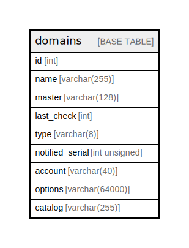

# domains

## Description

<details>
<summary><strong>Table Definition</strong></summary>

```sql
CREATE TABLE `domains` (
  `id` int NOT NULL AUTO_INCREMENT,
  `name` varchar(255) NOT NULL,
  `master` varchar(128) DEFAULT NULL,
  `last_check` int DEFAULT NULL,
  `type` varchar(8) NOT NULL,
  `notified_serial` int unsigned DEFAULT NULL,
  `account` varchar(40) CHARACTER SET utf8mb3 COLLATE utf8mb3_general_ci DEFAULT NULL,
  `options` varchar(64000) DEFAULT NULL,
  `catalog` varchar(255) DEFAULT NULL,
  PRIMARY KEY (`id`),
  UNIQUE KEY `name_index` (`name`),
  KEY `catalog_idx` (`catalog`)
) ENGINE=InnoDB AUTO_INCREMENT=[Redacted by tbls] DEFAULT CHARSET=latin1
```

</details>

## Columns

| Name | Type | Default | Nullable | Extra Definition | Children | Parents | Comment |
| ---- | ---- | ------- | -------- | ---------------- | -------- | ------- | ------- |
| id | int |  | false | auto_increment |  |  |  |
| name | varchar(255) |  | false |  |  |  |  |
| master | varchar(128) |  | true |  |  |  |  |
| last_check | int |  | true |  |  |  |  |
| type | varchar(8) |  | false |  |  |  |  |
| notified_serial | int unsigned |  | true |  |  |  |  |
| account | varchar(40) |  | true |  |  |  |  |
| options | varchar(64000) |  | true |  |  |  |  |
| catalog | varchar(255) |  | true |  |  |  |  |

## Constraints

| Name | Type | Definition |
| ---- | ---- | ---------- |
| name_index | UNIQUE | UNIQUE KEY name_index (name) |
| PRIMARY | PRIMARY KEY | PRIMARY KEY (id) |

## Indexes

| Name | Definition |
| ---- | ---------- |
| catalog_idx | KEY catalog_idx (catalog) USING BTREE |
| PRIMARY | PRIMARY KEY (id) USING BTREE |
| name_index | UNIQUE KEY name_index (name) USING BTREE |

## Relations



---

> Generated by [tbls](https://github.com/k1LoW/tbls)
