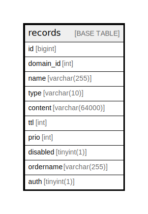

# records

## Description

<details>
<summary><strong>Table Definition</strong></summary>

```sql
CREATE TABLE `records` (
  `id` bigint NOT NULL AUTO_INCREMENT,
  `domain_id` int DEFAULT NULL,
  `name` varchar(255) DEFAULT NULL,
  `type` varchar(10) DEFAULT NULL,
  `content` varchar(64000) DEFAULT NULL,
  `ttl` int DEFAULT NULL,
  `prio` int DEFAULT NULL,
  `disabled` tinyint(1) DEFAULT '0',
  `ordername` varchar(255) CHARACTER SET latin1 COLLATE latin1_bin DEFAULT NULL,
  `auth` tinyint(1) DEFAULT '1',
  PRIMARY KEY (`id`),
  KEY `domain_id` (`domain_id`),
  KEY `ordername` (`ordername`)
) ENGINE=InnoDB AUTO_INCREMENT=[Redacted by tbls] DEFAULT CHARSET=latin1
```

</details>

## Columns

| Name | Type | Default | Nullable | Extra Definition | Children | Parents | Comment |
| ---- | ---- | ------- | -------- | ---------------- | -------- | ------- | ------- |
| id | bigint |  | false | auto_increment |  |  |  |
| domain_id | int |  | true |  |  |  |  |
| name | varchar(255) |  | true |  |  |  |  |
| type | varchar(10) |  | true |  |  |  |  |
| content | varchar(64000) |  | true |  |  |  |  |
| ttl | int |  | true |  |  |  |  |
| prio | int |  | true |  |  |  |  |
| disabled | tinyint(1) | 0 | true |  |  |  |  |
| ordername | varchar(255) |  | true |  |  |  |  |
| auth | tinyint(1) | 1 | true |  |  |  |  |

## Constraints

| Name | Type | Definition |
| ---- | ---- | ---------- |
| PRIMARY | PRIMARY KEY | PRIMARY KEY (id) |

## Indexes

| Name | Definition |
| ---- | ---------- |
| domain_id | KEY domain_id (domain_id) USING BTREE |
| ordername | KEY ordername (ordername) USING BTREE |
| PRIMARY | PRIMARY KEY (id) USING BTREE |

## Relations



---

> Generated by [tbls](https://github.com/k1LoW/tbls)
