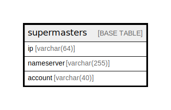

# supermasters

## Description

<details>
<summary><strong>Table Definition</strong></summary>

```sql
CREATE TABLE `supermasters` (
  `ip` varchar(64) NOT NULL,
  `nameserver` varchar(255) NOT NULL,
  `account` varchar(40) CHARACTER SET utf8mb3 COLLATE utf8mb3_general_ci NOT NULL,
  PRIMARY KEY (`ip`,`nameserver`)
) ENGINE=InnoDB DEFAULT CHARSET=latin1
```

</details>

## Columns

| Name | Type | Default | Nullable | Children | Parents | Comment |
| ---- | ---- | ------- | -------- | -------- | ------- | ------- |
| ip | varchar(64) |  | false |  |  |  |
| nameserver | varchar(255) |  | false |  |  |  |
| account | varchar(40) |  | false |  |  |  |

## Constraints

| Name | Type | Definition |
| ---- | ---- | ---------- |
| PRIMARY | PRIMARY KEY | PRIMARY KEY (ip, nameserver) |

## Indexes

| Name | Definition |
| ---- | ---------- |
| PRIMARY | PRIMARY KEY (ip, nameserver) USING BTREE |

## Relations



---

> Generated by [tbls](https://github.com/k1LoW/tbls)
