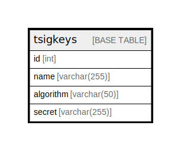

# tsigkeys

## Description

<details>
<summary><strong>Table Definition</strong></summary>

```sql
CREATE TABLE `tsigkeys` (
  `id` int NOT NULL AUTO_INCREMENT,
  `name` varchar(255) DEFAULT NULL,
  `algorithm` varchar(50) DEFAULT NULL,
  `secret` varchar(255) DEFAULT NULL,
  PRIMARY KEY (`id`),
  UNIQUE KEY `namealgoindex` (`name`,`algorithm`)
) ENGINE=InnoDB DEFAULT CHARSET=latin1
```

</details>

## Columns

| Name | Type | Default | Nullable | Extra Definition | Children | Parents | Comment |
| ---- | ---- | ------- | -------- | ---------------- | -------- | ------- | ------- |
| id | int |  | false | auto_increment |  |  |  |
| name | varchar(255) |  | true |  |  |  |  |
| algorithm | varchar(50) |  | true |  |  |  |  |
| secret | varchar(255) |  | true |  |  |  |  |

## Constraints

| Name | Type | Definition |
| ---- | ---- | ---------- |
| namealgoindex | UNIQUE | UNIQUE KEY namealgoindex (name, algorithm) |
| PRIMARY | PRIMARY KEY | PRIMARY KEY (id) |

## Indexes

| Name | Definition |
| ---- | ---------- |
| PRIMARY | PRIMARY KEY (id) USING BTREE |
| namealgoindex | UNIQUE KEY namealgoindex (name, algorithm) USING BTREE |

## Relations



---

> Generated by [tbls](https://github.com/k1LoW/tbls)
